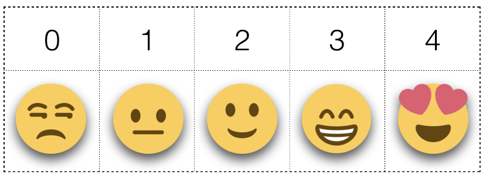
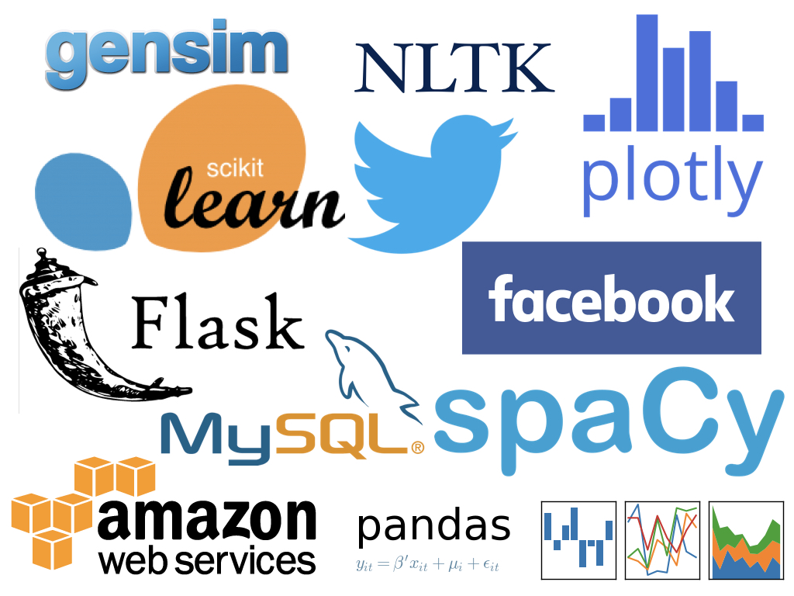

# Classifying Twitter

## Motivation 

Twitter is a rich ecosystem. Even with the constraint of 14 characters allotted per tweet, people have no problem expressing emotions, opinions, and facts. So it comes as no surprise that there are over 500 million tweets per day! This is not a bad thing. In fact, it is the opposite. The vast abundance of tweets provides people with the perfect environment to form relationships and taking full advantage of this can make any business successful. This was the vision that created Aingines.world.   

## Apposphere

Aingines.world is a start-up based here in Austin that focuses on extracting business leads from Twitter, Facebook, and other social media outlets and delivering them to clients. Once these leads are delivered, businesses can strike up conversations in however way they please through Aingine.world's custom CRM program.

The success rate is astounding at over 70%. This makes leads Aingine, their classification system, much more desirable than pay-per-click (PCP) ads, which are elusive, expensive, and often unsuccessful.

 

## Motivation 

Acquiring leads via other outlets, such as PCP and event sponsorships, is an expensive and elusive endeavor. My professional experience with this problem has always left my colleagues and even 'experts' confounded. Fortunately, I now have the skills to tackle this problem.  With data science, I aim to outperform Apposphere's current algorithm on classifying tweets.

 

## Data

The tweets came from a Twitter API, which was stored in Apposphere's MySQL database. Out of a population of 2.8 million tweets, I used a random sample of 150,000. I did this to remove duplicates, since there were many duplicate tweets from multiple users (spam). 

I also toyed around with larger datasets, but adding more than 150,000 provided marginal benefits to the model at the expense of long, drawn-out computations. 

    
 

## Feature Engineering

There are numerous ways to include text into your model, and I took full advantage of that. I used simple bag of words (CBOW) matrices, term frequency-inverse document frequency (Tf-IDF) matrices, and doc2vecs.

 

## Models

I tested five models, starting from the most basic Logistic Regression model to the most complicated Fasttext model. For each model, I used the different features to make sure that I chose the best one.

## Results

    

## Interesting Revelations 

As you have seen above, I have worked with three different types of features, each more complicated than the one before. At first glance, you would expect that the doc2vec arrays would be the most robust. Instead, I saw a drastic decrease in accuracy. Below is a t-SNE representation of the doc2vec arrays. It appears as one big clump with no discernible patterns. I believe this is because the doc2vec arrays capture another characteristic, different than the one I would like to test. 

    
 

## Future Plans 
Given the feature engineering I did to make my models learn best from the data, there are still many more things I can do to improve my scores. However, in the immediate future my model will be deployed and used in production.

## Appendix 

### Dependencies

 

