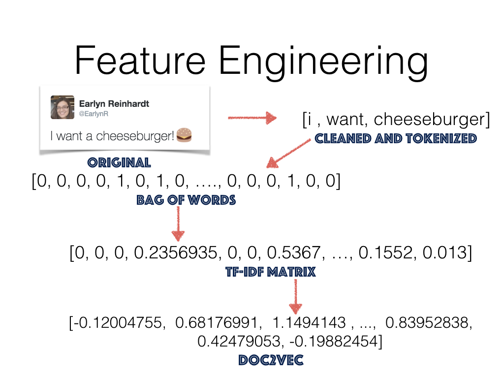
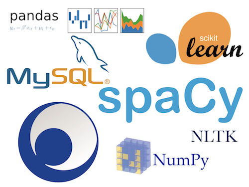

# Classifying Twitter

## Motivation 

Twitter is a rich ecosystem. Even with the constraint of 14 characters allotted per tweet, people have no problem expressing emotions, opinions, and facts. So it comes as no surprise that there are over 500 million tweets per day! This is not a bad thing. In fact, it is the opposite. The vast abundance of tweets provides people with the perfect environment to form relationships and taking full advantage of this can make any business successful. This was the vision that created Apposphere.   

## Apposphere

Apposphere is a start-up based here in Austin that focuses on extracting business leads from Twitter and delivering them to clients. Once these leads are delivered, businesses can strike up conversations in however way they please through Apposphere's custom CRM program.

The success rate is astounding at over 70%. This makes Aingine, their classification system, much more desirable than pay-per-click (PCP) ads, which are elusive, expensive, and often unsuccessful.

 

## Motivation 

My capstone project aims to improve Apposphere's current algorithm on classifying tweets based on the quality of leads.   

## Data

The tweets came from a Twitter API, which was stored in Apposphere's MySQL database. Out of a population of 2.8 million tweets, I used a random sample of 150,000. 

    
    

## Feature Engineering

There are numerous ways to include text into your model, and I took full advantage of that. I used simple bag of words (CBOW) matrices, term frequency-inverse document frequency (Tf-IDF) matrices, and doc2vecs.

 

## Models

I tested five models, starting from the most basic Logistic Regression model to the most complicated Fasttext model. For each model, I used the different features to make sure that I chose the best one.

## Results

Please come to my capstone presentation and see for yourself!

## Future Plans 
Though I have done a lot for this project, I feel like I am nowhere near done. The possibilities are endless in trying to make this better. However, in the immediate future, my model will be deployed and used in production.

## Appendix 

### Dependencies

 

